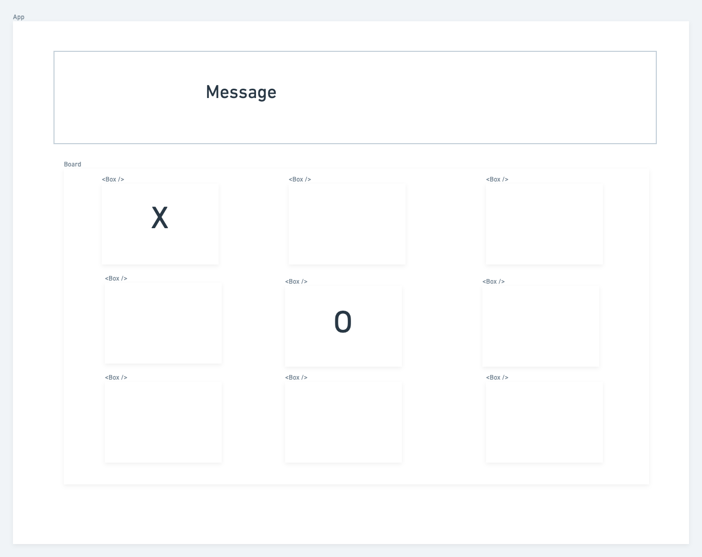

#wireframe 

#Plan

Set up your GameContext and initialize your board state (I would model the board as an array of objects that track the space number and the content in the space. Empty spaces can just have an empty string. {space: 4, content: ''}))
Initialize your state
currentPlayer (‘X’ or ‘O’)
active (true / false)
gameMessage (says who’s turn it is, who won or if its a cats game)
Create a Board component which reads the board state from the context and renders a Box component for each space
Add a click handler to the Box component that calls a function in the context for handling a space click
Add the logic for handling the space click in game context
If the space already contains an ‘X’ or an ‘O’, return
If the game is no longer active, return
Otherwise, set the space’s content to the current player
Switch current player
On every render of the App, you should check the game status and set active to false if any of the “end game” conditions are met
All spaces are taken (Cats / Scratch game)
A player has 3 in a row (don’t be too clever about this - you can just have repetitive code to check for a winner)
If the end game conditions are met, update active and the game message
Add a button to reset the game
Should reset the board
Reset the current player to ‘X’
Update game message
